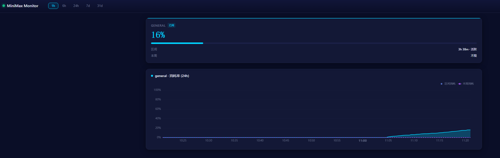
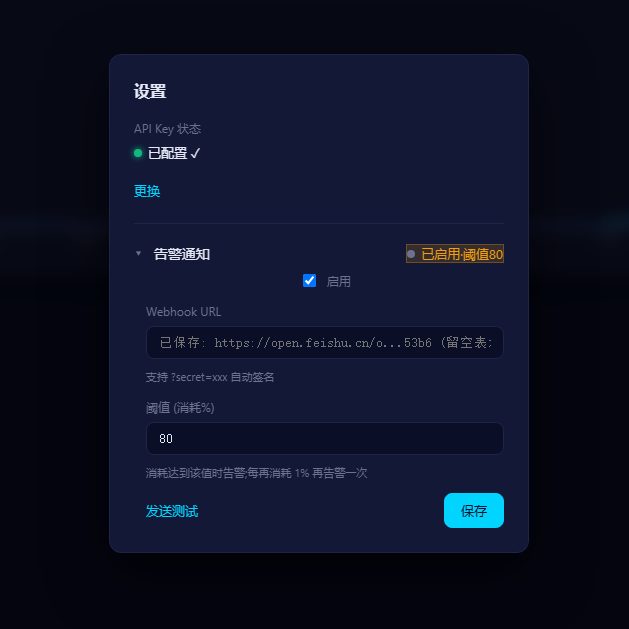

# MiniMax 套餐额度监控

单二进制 Go 服务，每 10 秒拉取一次 MiniMax `/v1/token_plan/remains` 接口，
并在本地暗色主题仪表盘中可视化展示 **31 天**的历史数据。

- **单二进制** — 所有 Web 资源全部内嵌；无 CGO；跨平台。
- **安全** — API key 保存在操作系统钥匙串（Windows 凭据管理器 / macOS 钥匙串 / Linux Secret Service）。
- **实时** — WebSocket 推送模型卡片；ECharts 趋势图。
- v1 版本**不带告警**；**无鉴权**（依赖监听地址绑定）。




## 快速开始（Windows）

```bat
build.bat
dist\minimax-monitor.exe
:: 浏览器打开 http://localhost:13337
```

然后点击 ⚙，粘贴你的 `sk-cp-...` 密钥，点击 **保存并验证**。

## 自定义端口运行

```bat
dist\minimax-monitor.exe -p 18080
```

默认监听：`0.0.0.0:13337`（所有网卡）。

## 配置（环境变量）

| 变量 | 默认值 | 说明 |
|---|---|---|
| `POLL_INTERVAL` | `10s` | 拉取间隔 |
| `DB_PATH` | `./data/monitor.db` | SQLite 数据库文件 |
| `RETENTION_DAYS` | `31` | 数据保留天数（超过即清理） |
| `LOG_LEVEL` | `info` | `debug` / `info` / `warn` / `error` |
| `KEYRING_SERVICE` | `minimax-monitor` | 操作系统钥匙串服务名 |
| `KEYRING_USER` | `default` | 操作系统钥匙串用户名 |

监听地址**只能**通过 `-p <port>` 命令行参数配置。

## 告警通知（飞书 / Lark）

当配置好的**消耗**阈值被突破时，仪表盘可以向飞书（或 Lark）自定义机器人
发送交互式卡片通知。

1. 点击页头的 ⚙ → 展开"告警通知"。
2. 粘贴你的 Webhook URL（可以带 `?secret=...`，系统会自动检测签名）。
3. 设置阈值（默认 80）。当**消耗百分比**达到该值时触发告警，之后每多消耗
   1% 再告警一次，直到 5 分钟窗口重置。
4. 点击"保存"，再点"发送测试"验证投递是否正常。

页面上的 Webhook URL 会脱敏显示（完整 URL 包含机器人密钥）。切换"启用"
或修改阈值时，如果想保留原 URL，**把 URL 输入框留空即可** —— 系统会保留
已保存的 URL。只有真的要替换 URL 时才粘贴新值。

当 5 分钟窗口在真实使用后滚动重置时，会单独再发一张 `🔄 配额重置` 卡片，
汇总该窗口期内的最高消耗。

关闭告警会清空所有去重状态，下次重新启用时从全新窗口开始。

## 交叉编译（Windows → 全平台）

```bat
build-cross.bat
```

产物：
- `dist/minimax-monitor-linux-amd64`
- `dist/minimax-monitor-linux-arm64`
- `dist/minimax-monitor-darwin-arm64`
- `dist/minimax-monitor-windows-amd64.exe`

## 构建（Linux / macOS）

```bash
make build       # 当前平台
make build-all   # 全部平台
make test        # go test ./...
```

## 项目结构

完整设计见 [`docs/superpowers/specs/2026-06-27-minimax-monitor-design.md`](docs/superpowers/specs/2026-06-27-minimax-monitor-design.md)，
实现计划见 [`docs/superpowers/plans/2026-06-27-minimax-monitor.md`](docs/superpowers/plans/2026-06-27-minimax-monitor.md)。

## 许可证

私有项目，暂未开源许可。
